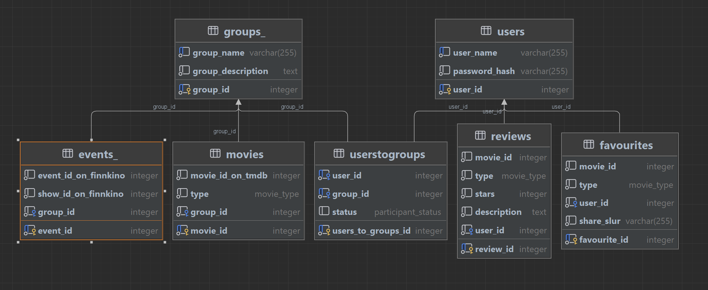

# OAMK Tietotekniikan opiskelijoiden web-ohjelmoinnin sovellusprojekti keväällä 2024

## Muuvi-projekti

Muuvi-projekti on Oulun ammattikorkeakoulun tieto- ja viestintätekniikan opiskelijoiden toisen opiskeluvuoden
alkupuoliskolla toteuttama harjoitteluprojekti.
Projektissa opiskeltiin fullstack-kehitystä siten, että toteutettavina osina olivat tietokanta, backend ja frontend.
Projektiryhmän opiskelijoiden kesken sovittiin jokaiselle opiskelijalle omat toteutettavat kokonaisuudet siten, että
jokainen osa toteutus sisälsi kaikki kolme osiota.

## Mistä projektissa on kyse

Projektissä työstettiin prototyyppi muotoista web-sovellusta elokuvaharrastajille. Sovelluksen tarkoituksena on tarjota
käyttäjille mahdollisuus hakea elokuvia sekä elokuvateattereiden näytösaikoja. Käyttäjät voivat luoda itselleen
suosikkilistan elokuvista ja sarjoista, ja jakaa sen halutessaan muiden käyttäjien kanssa. Lisäksi sivustolla on
mahdollisuus luoda omia ryhmiä, joiden sivuja pystyy kustomoimaan ja täydentämään haluamillaan elokuvilla ja
näytösajoilla.

Projektin tarkoitus oppimisen näkökulmasta on harjoitella web-ohjelmoinnin perusteita fullstack-kehityksessä ja soveltaa
niitä käytännön projektissa. Tavoitteena on oppia suunnittelemaan ja toteuttamaan vaatimusmäärittelyn mukainen
web-sovellus käytettävissä olevan ajan puitteissa, käyttämään erilaisia teknologioita ja työkaluja, sekä kehittää
yhteistyö- ja projektinhallintataitoja ryhmätyössä.

## Projektiryhmä

- Juho Hietala, projektipäällikkö, ohjelmistokehittäjä
- Mikko Kujala, scrum master, ohjelmistokehittäjä
- Janne Paaso, ohjelmistokehittäjä
- Tauno Jokinen, ohjelmistokehittäjä

## Keskeiset teknologiat

**Projekti toteutettiin käyttäen seuraavia teknologioita:**

- Kehitysympäristöt: IntelliJ IDEA, WebStorm ja Visual Studio Code
- Testauskirjastot: Mocha ja Chai
- Frontend tekniikat ja kirjastot: React, JSX, CSS, Axios
- Backend tekniikat ja kirjastot: Java, Spring Boot, JPA, Hibernate ja Maven
- Tietokanta: PostgreSQL
- Konttiohjelmisto: Docker
- Versionhallinta: Git

## Sovelluksen arkkitehtuuri

Sovelluksen fullstack arkkitehtuuri perustuu aiemmin kuvailtuihin
teknologioihin: React, Java Springboot, Postgres ja JPA Hibernate ORM.

React sovellus tekee pyyntöjä Finnkino APIin sekä Java Springboot palvelimelle REST rajapinnan yli.
Palvelin on yhteydessä julkisiin rajapintoihin, joihin tarvitaan API avain, sekä Postgres tietokantaan
Render.com palvelussa. Palvelimen tarkoitus on myös mahdollistaa siisti ja selkeä frontend koodi
yhdistelemällä eri toimintoja kuten tietokantadatan ja julkisten rajapintojen välisiä yhteyksiä
esimerkiksi elokuvadatan noutamisessa.

Sovelluksen eri toiminnot kuten käyttäjän luominen, kirjautuminen sekä elokuvien hakeminen on
palvelimella jaettu omiin palveluketjuihin. Palvelimelle määritetyt REST-ohjaimet toteuttavat
päätepisteitä, joita voidaan kutsua React sovelluksesta. REST-ohjaimet käyttävät saman nimisiä
palvelu-luokkia bisneslogiikan toteuttamiseen. Palvelu-luokat puolestaan hyödyntävät arkisto-luokkia,
jotka käsittelevät malli-luokissa kuvattua tietokantadataa.

**Tietokannan rakenne käy ilmi alla olevasta ER-kaaviosta:**



## Koodin toteutus ja nimeämiskäytännöt

Projektikoodi on toteutettu modulaarisesti. Riippuen toiminnon laajuudesta ja muista tekijöistä,
koodi on jaettu toiminnallisiin komponentteihin sekä tiedostoihin. Nämä komponentit sisältävät
usein toisia komponentteja, mikä helpottaa koodin ymmärtämistä ja ylläpitämistä. Palvelinpuolella
eri toiminnallisuudet on jaettu omiin Java-luokkiin erillisiin tiedostoihin.

Jokainen React-komponentti on nimetty sen toiminnallisuuden mukaan. Palvelimen ohjain-, palvelu-, arkisto-
ja malliluokat noudattavat samaa periaatetta.

## Käyttöönotto

**Ohjeet sovelluksen käynnistämiseksi paikallisesti**

1. Kloonaa projekti omalle koneellesi GitHubista.
2. Asenna tarvittavat riippuvuudet frontend-kansioon komennolla `npm install`.
3. Kirjoita .env tiedosto backend-hakemistoon. Esimerkki tiedosto löytyy
   backend-kansiosta ja tämän listan alta.
4. Muokkaa front-hakemistossa olevaan `.env`-tiedostoon oikea backendin osoite.
5. Ota PostgreSQL käyttöön paikallisesti.
6. Rakenna backend komennolla `mvn -Dmaven.test.skip package`.
7. Aja backend komennolla `java -jar ./target/backend-0.0.1-SNAPSHOT.jar`.
8. Aja frontend komennolla `npm run dev`.

**.env tiedoston esimerkki backend-kansiossa:**

```dotenv
DB_USER=database_username
DB_PASSWORD=super_secret_password
DB_HOST=localhost_default_port_5432
TMDB_API_KEY=its-my-secret
JWT=salisbury-steak
FRONTEND_ORIGIN=http://localhost:5175/
```

## REST-API dokumentaatio

REST-API dokumentaatio on luettavissa [täältä](https://documenter.getpostman.com/view/31007978/2sA3Bt3A1n).

## Linkki palvelimelle

Voit kokeilla sovellusta osoitteessa [muuvit.onrender.com](https://muuvit.onrender.com/).

## Sovelluksen esittelyvideo

Esittelyvideo sovelluksesta
nähtävillä [täällä](https://oamk-my.sharepoint.com/:v:/g/personal/c3kumi03_students_oamk_fi/EVdW_A_piQlMuFvIwI8sdQsBL-o0pWKsqHPgHfaCceguAw?e=DJczF8).

## Lisenssi

Tämä projekti on lisensoitu MIT-lisenssillä. 

```
Tekijänoikeus (c) 2024 Juho Hietala, Tauno Jokinen, Mikko Kujala, Janne Paaso

Tämän ohjelmiston ja siihen liittyvien dokumentaatioiden (jäljempänä "Ohjelmisto") kopiointi,
levittäminen ja muokkaaminen on sallittua maksutta kenelle tahansa. Tämä sisältää oikeuden
käyttää, kopioida, muokata, yhdistää, julkaista, jakaa, myydä ja sublicensoida Ohjelmistoa
ilman rajoituksia, edellyttäen että seuraavat ehdot täyttyvät:

Yllä oleva tekijänoikeusilmoitus ja tämä lupa sisällytetään kaikkiin tai oleellisiin Ohjelmiston
kopioihin.

OHJELMISTO TARJOTAAN "SELLAISENAAN", ILMAN MITÄÄN TAKUITA, OLIVAT NE SITTEN ILMAISIA TAI
KAUPALLISIA, MUKAAN LUKIEN, MUTTA EI RAJOITUKSETTA, TAKUUT MYYNTIKELPOISUUDESTA, SOPIVUUDESTA
TIETTYYN KÄYTTÖTARKOITUKSEEN JA TAKUUT NIIDEN RIKKOMISESTA. MISSÄÄN TAPAUKSESSA TEKIJÄT
TAI TEKIJÄNOIKEUDEN HALTIJAT EIVÄT OLE VASTUUSSA MISTÄÄN VAATEISTA, VAHINGOISTA TAI MUUSTA
VASTUUVELVOLLISUUDESTA, OLIVATPA NE SITTEN SOPIMUKSELLISIA, VAHINGONKORVAUKSIA TAI MUUTA,
OHJELMISTON TAI SEN KÄYTÖN TAI MUUN VUOROVAIKUTUKSEN VUOKSI.
```
